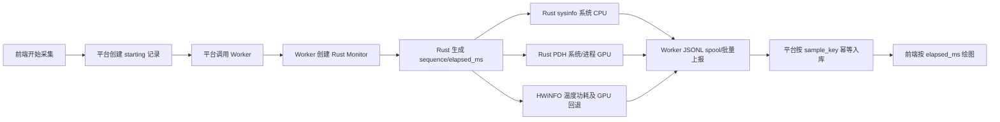

# Windows 性能采集审查与当前改造状态

## 1. 范围与结论

本次只覆盖 Windows 性能采集链路：

- `D:\code\perfwin`：Rust/PyO3 采集模块。
- `D:\code\autotest`：Worker 采集生命周期、上报和本地暂存。
- `D:\code\zq-platform`：平台后端、数据库迁移、前端页面。

核心结论：系统 CPU 已切换为 Rust `sysinfo`，系统 GPU 已切换为 Rust PDH，并保留 HWiNFO 作为 GPU 运行时回退及温度、功耗、频率等扩展指标来源。PDH 使用 `GPU Engine(*)\Utilization Percentage`，按适配器和引擎聚合，理论上覆盖 Intel/AMD 核显、NVIDIA/AMD 独显以及核显加独显混合机器。

当前代码已完成实现和本机验证闭环；开发数据库迁移、release wheel 构建和 Worker 安装验证均已完成。尚未在真实 Intel 核显、AMD 核显、独显和混合显卡 Windows 机器上验证，也尚未完成完整端到端联调和浏览器尺寸矩阵验收。

## 2. 当前数据链路

时间轴由 Rust `Instant` 生成：`sequence` 从 0 递增，`elapsed_ms` 是采集会话内相对毫秒时间。`timestamp` 只用于展示和审计，平台不再用 Worker 与平台的墙上时钟相减计算横轴。

## 3. Rust 采集结果

### 已完成

- `SystemMetrics.cpu_percent` 使用 Rust `sysinfo.global_cpu_usage()`。
- `SystemMetrics.gpu_percent` 使用 Rust PDH；PDH 成功但空闲时返回有效 `0`。
- PDH 按 PID、适配器、引擎聚合进程 GPU；按适配器和引擎聚合系统 GPU，适配器取最忙引擎，系统取所有适配器最大值。
- DXGI 枚举适配器并尝试按 LUID 映射名称，支持核显、独显和混合显卡的统一结构。
- PDH 连续失败达到阈值后尝试 HWiNFO GPU 使用率回退；两者都不可用时返回 `null`，不使用 0 伪装不可用。
- PyO3 暴露 `sequence`、`elapsed_ms`、`system`，系统指标可以序列化为 Python `None`。
- 版本已统一为 `0.4.0`。

### 仍需验证

- 没有真实核显机器验证 PDH 实例格式、DXGI LUID 映射和适配器名称。
- 没有验证混合显卡同时负载时“系统值取最大适配器”是否符合产品展示预期。
- 已构建并安装 `perfwin 0.4.0` release wheel 到 Worker venv，版本和 `Monitor`/`Sample` API 冒烟通过。
- Rust 目前 `cargo check` 通过，仅保留两个既有 dead-code warning；针对聚合的自动化测试仍不足。

## 4. Worker 流程审查与改造

### 已修复

- 同设备不同采集任务不再静默覆盖旧任务；启动冲突返回业务 `conflict`，HTTP 路由映射为 409。
- Monitor 创建异常返回业务错误，HTTP 路由映射为 503。
- 停止 ID 不匹配返回业务错误，HTTP 路由映射为 409。
- Worker 正常停止发送 `stopped` 终态事件。
- Rust Monitor 超时排空缓冲后发送 `timed_out` 终态事件。
- 采集线程异常停止 Monitor、尽量排空缓冲并发送 `failed` 终态事件；终态发送失败时写入独立 `.spool.terminal` 队列并自动重试。
- 停止流程把锁内状态变更与锁外 `join` 分开，并增加 stopping 状态，避免停止期间启动新任务覆盖旧任务。
- 样本透传 `sample_key`、`sequence`、`elapsed_ms`、`system`。
- 网络失败使用按采集任务的 JSONL spool，带 fsync、临时文件替换、重启扫描和批次重试。
- 平台业务响应不再只按 HTTP 200 判断，上报结果必须是成功业务状态。

### 未完成或风险

- 当前 spool 是可靠 JSONL 队列，不是计划中的 SQLite 确认队列；尚未实现连续序号确认、磁盘配额、指数退避和上传独立线程。
- Worker 异常退出、进程被强杀、机器断电场景仍需真实验证终态和残留 spool 的恢复行为。
- 没有 Worker 性能采集专项 pytest 和断网/重启集成测试。

## 5. 平台后端与数据库

### 已完成

- 采集状态扩展为 `pending/starting/running/stopping/stopped/failed/timed_out/interrupted`。
- 增加最后心跳、最后序号、最后毫秒时间、失败码、失败消息和结束原因。
- Worker 样本强制要求 `sample_key`、`sequence`、`elapsed_ms`，`system` 默认为空字典。
- 按 `sample_key` 去重，查询按 `elapsed_ms` 排序；乱序样本不会把最后序号回退。
- 校验上报 `device_id` 与采集记录归属一致。
- 增加 Worker 终态事件接口，重复终态通知保持幂等。
- 新增迁移 `f9b0c1d2e3f4_windows_performance_state_and_sequence.py`，回填历史 `sequence`、`elapsed_ms`、`sample_key`，增加唯一索引和时间索引。
- Alembic 当前唯一 head 为 `f9b0c1d2e3f4`。

### 未完成或风险

- 已在开发库 `192.168.0.102:5432/fastapi_db` 执行 `upgrade head`，当前 head 为 `f9b0c1d2e3f4`；尚未执行 `downgrade/upgrade` 回归。
- `relative_time` 仍作为历史兼容查询字段存在；新协议主字段是 `elapsed_ms`，尚未做彻底的旧字段删除。
- 平台缺少心跳超时自动对账任务，Worker 长时间离线仍需要后续补齐。
- 未补服务/API 专项测试，未完成真实 Worker、平台、数据库端到端联调。停止指定采集 ID 的设备归属校验已补齐。

## 6. 前端页面

### 已完成

- 系统 CPU/GPU 图表优先读取 `system_metrics`，缺失值保留 `null`。
- 图表 Y 轴、tooltip、当前值、详情面板对 `null` 安全处理，显示 `-`，不把不可用指标伪装成 0。
- GPU 页面显示来源标签：Rust PDH、HWiNFO 回退或不可用。
- 图表横轴使用 `elapsed_ms` 换算秒，比较页同步处理空点和标签时间。
- 主页面底部目标进程/TOP10 改为响应式网格，补充窄屏单列布局；顶部区域增加 sticky 处理。

### 未完成或风险

- 尚未用浏览器在 1920、1440、1280、1024、390 宽度截图验证溢出、遮挡和图表空白。
- 历史记录仍是弹窗，不是计划中的可折叠侧栏。
- 尚未补完整的“等待首样本、断流、数据积压、终态错误”可视化状态。
- 全仓库前端 typecheck 仍有与本次无关的既有错误；本次性能监控目录筛选未再输出相关错误。

## 7. 验证结果

已执行并通过：

- Worker venv：`python -m py_compile worker/performance_monitor.py worker/server.py`。
- 平台后端 `.venv`：性能模块和三份迁移脚本 `py_compile`。
- 平台后端 `.venv`：`python -m alembic heads`，唯一 head 为 `f9b0c1d2e3f4`。
- Rust：`cargo check`；`cargo test` 8 个测试通过，包含 GPU Engine 实例解析测试。
- 前端：`pnpm --filter @vben/web-ele typecheck` 的性能监控路径筛选无输出；完整仓库仍有既有错误。

未执行：数据库 `downgrade/upgrade` 回归、Windows 硬件矩阵、浏览器截图、完整端到端联调。

## 8. 后续实施顺序

1. 在开发库执行迁移 downgrade/upgrade 回归，并核对数据数量和唯一索引。
2. 构建并安装 perfwin 0.4.0 wheel 到 Worker venv，执行采样冒烟。
3. 先验证 Intel/AMD 核显，再验证 NVIDIA/AMD 独显和核显+独显混合机器。
4. 联调开始、首批样本、重复批次、停止、超时、异常、断网恢复和 Worker 重启。
5. 用浏览器完成页面尺寸矩阵截图检查，再决定是否继续做历史侧栏和状态摘要改版。